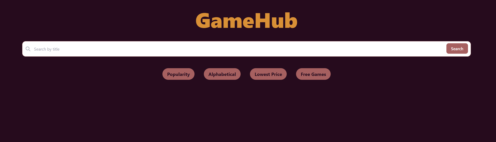
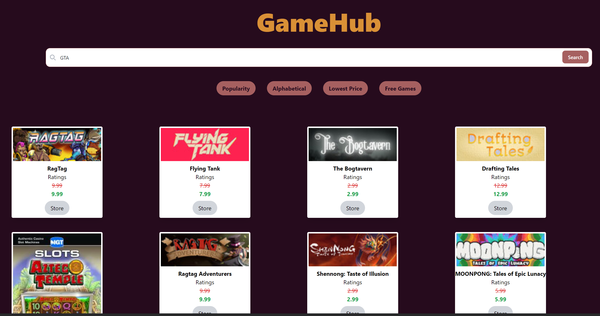

#  Game Hub

For Project-1, 5 developers worked as a team to create an application that uses a CSS framework (taiwind), and 2 APIs. Through delegation of tasks, we've created an application that helps users to find a video game title of choice at its cheapest price and location to purchase it, while also providing titles for free to play games. The deployed application may be viewed through the section titled ## Deployed application link. 

## Motivation
This project exsists to help video game enthusiasts, or video game gifters, make sure they are purchasing a video game title at the best deal possible.
 
## Screenshots

## Tech/framework used

<b>Built with:</b>
- [Tailwindcss](https://tailwindcss.com/)

<b>Languages used:</b>
 - [HTML]
 - [CSS]
 - [Javascript]

## Deployed application link

Deplyed application: https://crockevin.github.io/Project-1/

## API Reference

[API #1:] (https://apidocs.cheapshark.com/)
[API #2:] (https://www.freetogame.com/api-doc)

## How to use?
To use GameHub, use the search bar to type and search a video game title you'd like to find at the lowest price point possible. You will see all relevant video games, as well as their original price and discounted price. There are buttons to filter by, with the most important being the "Free Games" button. The Free Games button will load a new page that displays free to play games.

## Credits

<b>Contributors:</b>

Nic Diaz: https://github.com/nicanthoni
Kevin Hedengren: https://github.com/crockevin
Cesar Castro: https://github.com/SpacemanCeezer
Rodney Xavier: https://github.com/Rex10K
Brandon Greaux: https://github.com/BrandonG21

## License

MIT © [crockevin]()
